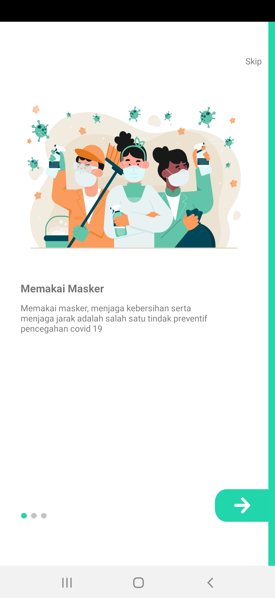
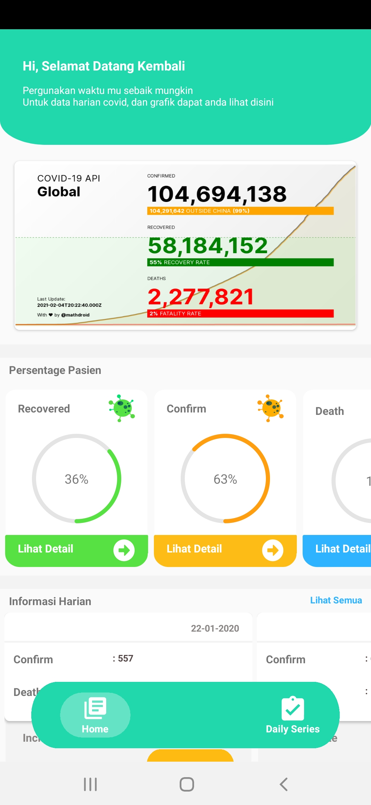
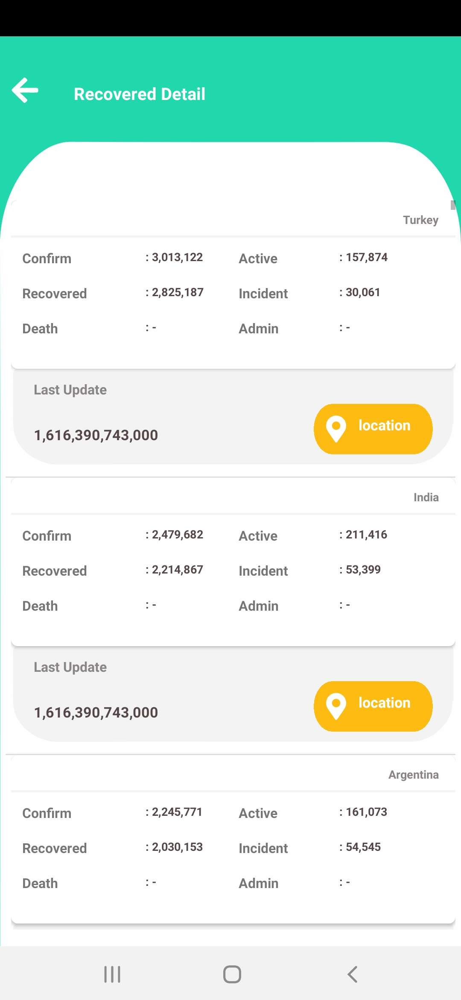
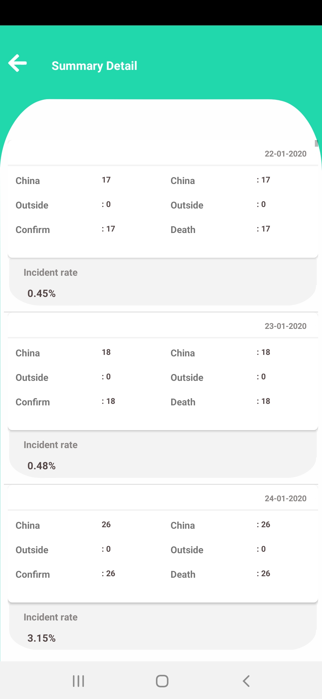

# Covid Monitoring

A Java Native application consume Covid API monitoring 
API: https://covid19.mathdro.id/api. 

# What's needed

- [Android Studio](https://developer.android.com/studio)
- [Android SDK](https://developer.android.com/studio)
- [Java](https://www.java.com/en/download/)

## Start

- Download source code or clone repository below command:

$ git clone https://github.com/daliworks/android-sample-app.git

- Import the covidProject project in the Project folder on the Android Studio

# Sample Application

      
